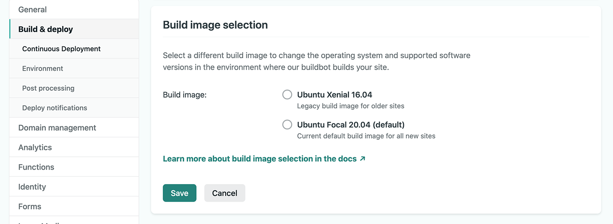

Gatsby製の当ブログを久しぶりに更新しようとしたところ、ホスト先であるNetlifyでデプロイエラーが出ていました。  
ログを確認したところ以下のようなメッセージが表示されていました。

```
9:41:00 PM: Build ready to start
9:41:00 PM: ---------------------------------------------------------------------
  UNSUPPORTED BUILD IMAGE

  The build image for this site uses Ubuntu 14.04 Trusty Tahr, which is no longer supported.

  To enable builds for this site, select a later build image at the following link:
  https://app.netlify.com/sites/glatch-tech/settings/deploys#build-image-selection

  For more details, visit the build image migration guide:
  https://answers.netlify.com/t/end-of-support-for-trusty-build-image-everything-you-need-to-know/39004
  ---------------------------------------------------------------------
```

どうやらしばらく触っていない間に使用しているビルドイメージがサポート対象外となってしまっていたようです。

1. Netlifyの[Deploys](https://app.netlify.com/sites/glatch-tech/deploys)から確認できるDeploy logにも記載がある[デプロイ設定画面](https://app.netlify.com/sites/glatch-tech/settings/deploys#build-image-selection)へアクセス
2. `Build image selection`の`Edit settings`をクリックし、`Ubuntu Focal 20.04 (default)`を選択し`Save`をクリック


以上で再度デプロイを実行して無事完了しました。